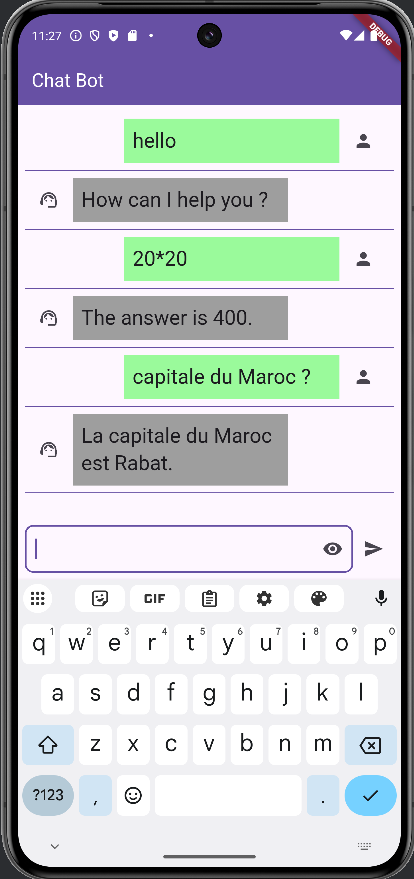

# ChatBotApp

## Chat Bot avec un LLM (Large Language Model)

Cette application a pour but de permettre aux utilisateurs de communiquer instantanément via des messages textuels en temps réel.
Elle offre une interface simple pour envoyer et recevoir des messages avec un LLM (ollama ou openai par exemple).

L'application utilise le framework Flutter pour la création d'interface utilisateur.

## Captures d'écran

Voici un aperçu de l'interface de chat :

<table>
    <tr>
        <tr>
            <th>Action</th>
            <th>Résultat</th>               
        </tr>
        <tr>
            <td>Login admin avec le mot de passe 1234</td>
            <td></td>
        </tr>
        <tr>
            <td>Chat avec le LLM Olama 3.2</td>
            <td></td>
        </tr>
    </tr>
</table>

# version Desktop 

## Comment cloner et exécuter l'application

Suivez ces étapes pour obtenir une copie locale du projet et l'exécuter :

1.  **Prérequis :**
    *   [Android Studio](https://developer.android.com/studio) (dernière version stable recommandée)
    *   Git

2.  **Cloner le dépôt :**
    Ouvrez un terminal ou une invite de commandes et exécutez la commande suivante :
    bash git clone https://github.com/elghariaoui/Demo_Chat_bot_AppMobile-Flutter-Bloc-LLM

3.  **Ouvrir dans Android Studio :**
    *   Lancez Android Studio.
    *   Choisissez "Open an existing Android Studio project" (ou "Open" depuis l'écran d'accueil).
    *   Naviguez jusqu'au dossier où vous avez cloné le projet et sélectionnez-le.

4.  **Synchronisation Gradle :**
    *   Android Studio va automatiquement essayer de synchroniser le projet avec les fichiers Gradle. Attendez que ce processus se termine. Cela peut prendre quelques minutes la première fois pour télécharger toutes les dépendances.

5.  **Démarrer Ollama 3.2 :**

    

6.  **Exécuter l'application :**
    *   Sélectionnez un émulateur Android disponible ou connectez un appareil Android physique.
    *   Ajouter l'option --dart-define=USE_LOCAL_API=true pour l'exécution locale sur l'émulateur Android, sinon elle sera exécutée sur l'appareil physique (web par exemple).
    *   Cliquez sur le bouton "Run 'app'" (l'icône de triangle vert ▶️) dans Android Studio.
    

---

C'est tout ! Vous devriez maintenant avoir l'application fonctionnant sur votre appareil ou émulateur. Si vous rencontrez des problèmes, vérifiez que tous les prérequis sont installés et que la synchronisation Gradle s'est terminée sans erreurs.
